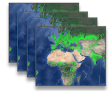
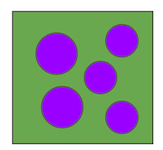
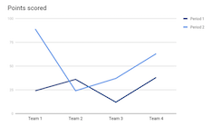
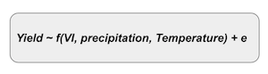

# Portable Remote Sensing Applications

## Global Crop Mask

There are 20 publically available global crop masks at various resolutions and time scales.

Task: stitch these crop masks into a normalized, unified non-temporal global mask.

 

## Vegetation Index (VI)

Mask VI indices (temporal stack) with unified crop mask from above => only crop pixels remain.

 
 
 
 

## Convert VI to Time Series

Aggregate VI values over crop pixels per admin area. Convert these spatial average values into time series.

 
 
 
 

## Machine Learning

Correlate observed yield values (from LSMS, ministry, or simulations) with VI and climate time series. This can be done with regression or deep learning or any of your favorite ML tools.